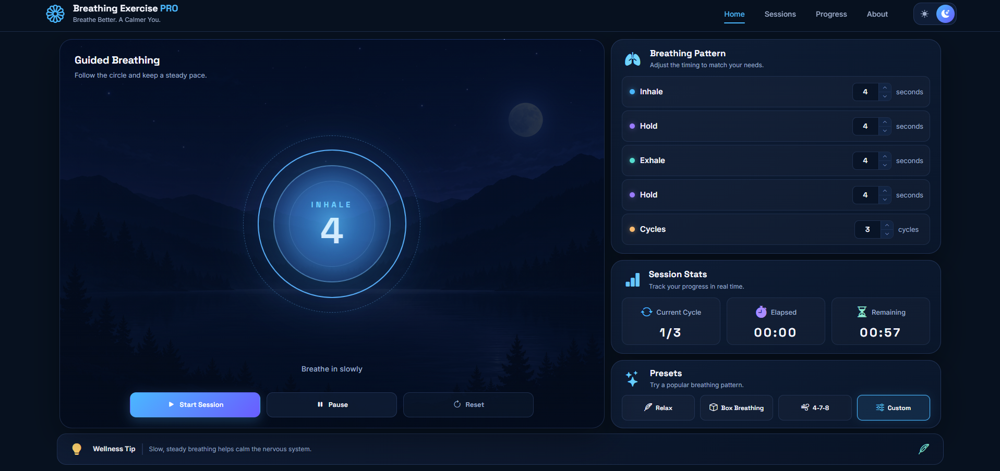

<div align="center">

# 🌬️ Breathing Exercise PRO

### Breathe Better. A Calmer You.

A modern guided breathing application built with HTML, CSS and Vanilla JavaScript.

Customize your breathing pattern, follow an animated breathing circle, track your session in real time and choose from popular breathing presets.

<br>


<br>

[🌐 Live Demo]()

</div>

---

## 📸 Preview



---

## ✨ Features

- 🌬️ Guided breathing sessions
- ⏱️ Real-time breathing countdown
- 🔄 Multiple breathing cycles
- 🎛️ Custom breathing pattern controls
- ➕ Custom number input controls
- ▶️ Start session
- ⏸️ Pause and resume session
- 🔄 Reset session
- 📊 Real-time session statistics
- 🌙 Dark mode
- ☀️ Light mode
- 📱 Fully responsive design
- 💾 Theme preference saved with Local Storage

### Breathing Controls

Users can customize:

- Inhale duration
- Hold duration
- Exhale duration
- Hold after exhale
- Number of cycles

### Built-in Presets

#### 🌿 Relax

```text
Inhale: 4s
Hold: 4s
Exhale: 6s
Hold: 2s
```

#### ⬜ Box Breathing

```text
Inhale: 4s
Hold: 4s
Exhale: 4s
Hold: 4s
```

#### 💨 4-7-8

```text
Inhale: 4s
Hold: 7s
Exhale: 8s
Hold: 0s
```

#### 🎚️ Custom

Allows the user to create their own breathing pattern.

---

## 🧠 How It Works

The application uses a simple breathing state machine.

A session moves through four possible phases:

```text
INHALE
   ↓
HOLD
   ↓
EXHALE
   ↓
HOLD
   ↓
NEXT CYCLE
```

Each phase has its own duration.

The JavaScript keeps track of:

```text
currentPhase
currentCycle
secondsRemaining
elapsedSeconds
isStarted
isPaused
```

When one phase reaches zero seconds, the application determines which breathing phase should run next.

If the current cycle is the final cycle, the session is completed.

---

## 🔵 Animated Breathing Circle

The breathing circle visually follows the current breathing phase.

```text
INHALE
→ circle expands

HOLD
→ circle stays expanded

EXHALE
→ circle contracts

HOLD
→ circle stays contracted
```

The animation duration automatically matches the duration selected by the user.

---

## 📊 Session Statistics

During the breathing session the dashboard tracks:

- Current cycle
- Elapsed session time
- Remaining session time

The remaining session duration is calculated from:

```text
cycle duration × number of cycles
```

---

## 🛠️ Technologies

### HTML5

Used for the semantic structure of the application.

### CSS3

Used for:

- Responsive layout
- CSS Grid
- Flexbox
- Gradients
- Glow effects
- CSS variables
- Light / Dark themes
- Responsive breakpoints
- Breathing animations

### Vanilla JavaScript

Used for:

- DOM manipulation
- Application state
- Timers
- Breathing phase logic
- Presets
- Session controls
- Dynamic statistics
- Theme switching
- Local Storage
- Responsive navigation

### Bootstrap Icons

Used throughout the interface for UI icons.

---

## 🚀 Run Locally

Clone the repository:

```bash
git clone https://github.com/JohnYisBackk/breathing-exercise-pro.git
```

Open the project directory:

```bash
cd breathing-exercise-pro
```

Then open:

```text
index.html
```

You can also run the project using **Live Server** in Visual Studio Code.

---

## 🎯 What I Learned

This project helped me practice and better understand:

- Managing application state
- Working with `setInterval()`
- Starting and stopping timers
- Building a state machine
- Separating application logic from UI updates
- Working with reusable functions
- Reading values from form inputs
- Creating configurable application behavior
- Using `dataset`
- Using `closest()`
- Working with `stepUp()` and `stepDown()`
- Calculating elapsed and remaining time
- Creating breathing phase transitions
- Building animated UI based on JavaScript state
- Implementing presets
- Creating responsive dashboard layouts
- Saving user preferences with Local Storage

---

## 👨‍💻 Author

**Samuel Jahn**

Frontend Developer

🌐 [Portfolio](https://samueljahn.sk)

💻 [GitHub](https://github.com/JohnYisBackk)

---

## 📄 License

This project is licensed under the **MIT License**.

See the [LICENSE](LICENSE) file for details.

---

<div align="center">

### 🌬️ Breathe Better. A Calmer You.

Made with ❤️ by Samuel Jahn

</div>
